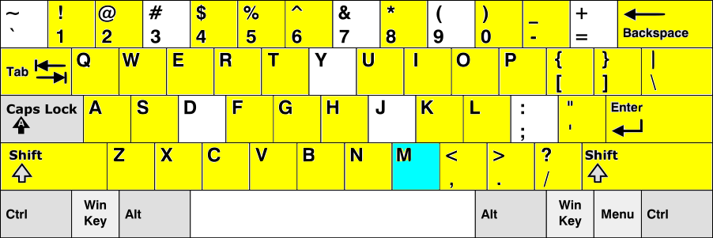

# Pianoputer

This repository contains a minimal code to play on your computer keyboard like if it was a piano, an instrument that I call the Pianoputer (yeah I am not very good at names). Here is a [video](https://www.youtube.com/watch?v=z410eauCnHc) of the program in action.


## Play!

Pianoputer only works in python3 so make sure you are using python3
```
pip install pianoputer
pianoputer
```

After a few seconds, the below image will appear in a window, indicating that the program is ready.
The cyan key is the key that the sample wav file is assigned to. By default this is c4, [the piano middle C at 261.6 hz](https://en.wikipedia.org/wiki/Piano_key_frequencies)



## Changing the sound file

You can provide your own sound file with

```
pianoputer --wav my_sound_file.wav
```
All yellow keys are transposed up and down from the anchor cyan key.

## Changing the keyboard layout

Note that the default keyboard configuration (stored in file `keyboard_qwerty_43keys.txt`) is for the most commonly used QWERTY keyboards. You can change the configuration so that it matches your keyboard, for instance using the alternative `keyboards/azerty_49keys.txt`:

```
pianoputer -k keyboards/azerty_49keys.txt -w audio_files/bowl_c6.wav
```

These `.txt` files simply contain a sequence of key names and are easy to edit. For convenience this repository also provides a `make_kb_file.py` program:
```
python make_kb_file.py
```

This will let you press the keys in the order that you want, and create a new keyboard configuration file, by default `my_keyboard.kb` (just follow the instructions). You can then use the custom keyboard file with the --keyboard argument

## Local Installation
```
python3 -m venv venv
source venv/bin/activate
# if you want to edit the program and have pianoputer use your edits
pip install -e .
# to install pianoputer separately in your virtual environment
pip install .
pianoputer
```

## Attributions
- qwerty keyboard images By No machine-readable author provided. Denelson83 assumed (based on copyright claims). - No machine-readable source provided. Own work assumed (based on copyright claims)., CC BY-SA 3.0, https://commons.wikimedia.org/w/index.php?curid=508928
- azerty keyboard images By Monpanda - travail personnel à partir d&#039;une autre image Commons File:Azerty fr.svg, CC BY-SA 3.0, https://commons.wikimedia.org/w/index.php?curid=6935419
- c4 piano sample from https://en.wikipedia.org/wiki/File:Middle_C.mid
